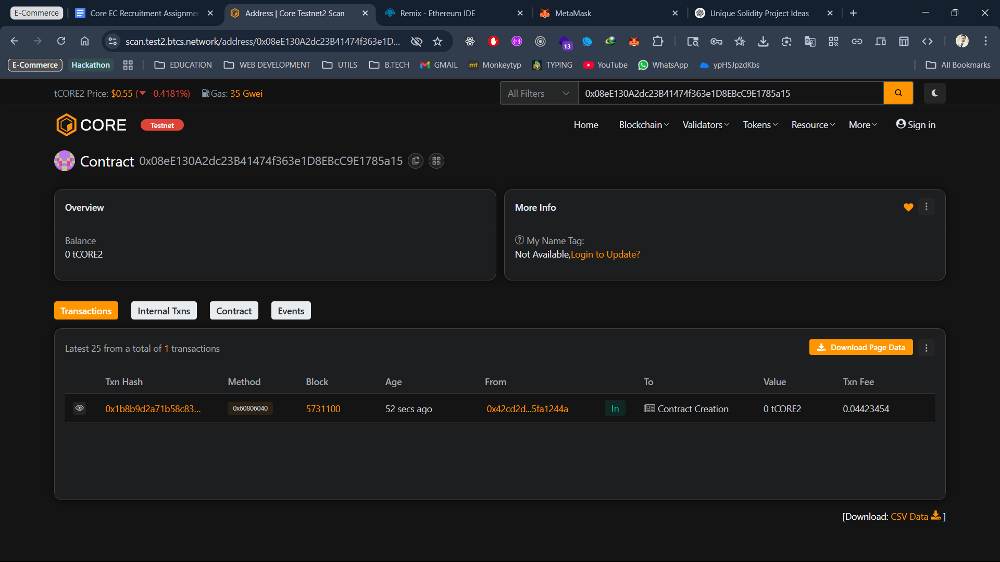

# Project Title

Time-Locked Multisig Will & Estate Executor

---

## Project Description

A smart contract that enables users to set up an on‑chain will. The contract tracks periodic “check‑ins” by the owner; if the owner fails to check in within a specified interval, the contract automatically distributes the owner’s estate according to a predefined inheritance plan.

## Project Vision

To provide a trustless, transparent, and autonomous digital estate planning tool that ensures heirs receive their inheritance without requiring centralized intermediaries or manual execution.

## Key Features

* **Executor(s)**: Designate **one or more** executor addresses who can trigger the will execution once the owner misses a check‑in.
* **Configurable Check‑In Interval**: Owners set their own check‑in frequency (e.g., hourly, daily, yearly).
* **Flexible Inheritance Mapping**: Define percentage allocations for multiple heirs directly in the contract.
* **Automatic Execution**: On‑chain enforcement of the will, removing reliance on off‑chain processes.
* **ETH Reception**: Contract can receive ETH at any time to fund the estate.

## Deployment & Verification

After running the Hardhat deploy script, you can verify the contract on Core Testnet2. Below is a deployment screenshot:



> **Contract Address:** `0x08eE130A2dc23B41474f363e1D8EBcC9E1785a15`

## Future Scope

* **ERC-20 & ERC-721 Support**: Extend inheritance beyond ETH to tokens and NFTs.
* **Off-Chain Oracles**: Integrate with oracles to verify owner status (e.g., medical records).
* **Gasless Transactions**: Enable meta‑transactions for check‑ins to improve UX.
* **Web UI Dashboard**: Build a frontend for managing executors, heirs, and monitoring contract status.

## Contract Details

*(Fill this section manually – constructor parameters, function signatures, event descriptions, etc.)*

```
constructor(address[] memory _executors, uint256 _interval)
function checkIn() external
function addExecutor(address _exec) external
function removeExecutor(address _exec) external
function setInheritance(address heir, uint8 percent) external
function executeWill() external
receive() external payable
```
